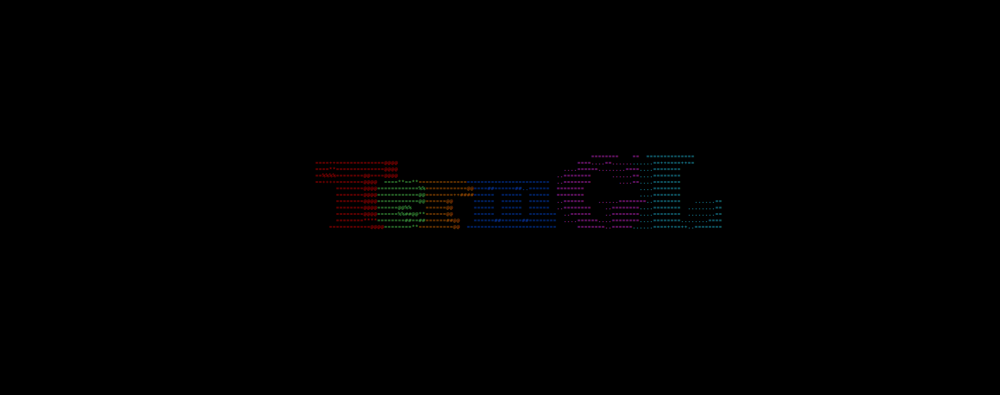
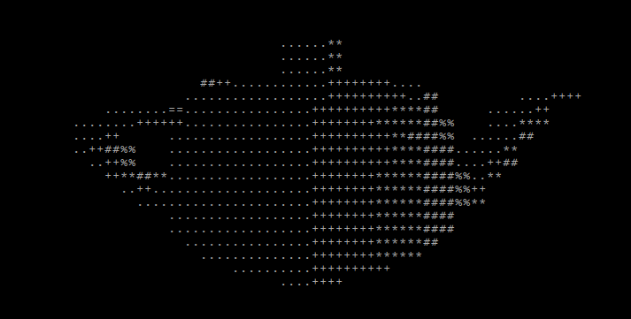

# TermGL

A terminal-based graphics library for both 2D and 3D graphics.\
Works in all terminals supporting ANSI escape codes.\
Support for Windows and UNIX.\
C99 compliant, with no external dependencies. Can also be used in C++.\
Realtime input reading from terminal for user-interaction.\
16 Background colors, 16 foreground colors, bold and underline.

### Gallery






### Build

You can compile `termgl.c` as you would any other C source file. You can also compile it as a shared library `libtermgl.so` by calling `make shared`. To install the shared library, `sudo make install`.

To enable 3D functionality, use the ```-DTERMGL3D``` compiler flag.\
To enable utility functions, use the ```-DTERMGLUTIL``` compiler flag.

To use TermGL in C++, compile it as a shared library and link against the `libtermgl.so` file. The `termgl.h` header can be included in C++ files.

To compile a demo program, run  `make demo`, creating the `termgl_demo` binary.

To cross-compile, set the `CC` variable to the appropriate compiler.

### Documentation

Certain settings can be changed at the top of [src/termgl.c](src/termgl.c) prior to compilation, e.g. memory allocation functions, clear screen command, compiler-specific commands.\
The header file [lib/termgl.h](lib/termgl.h) contains brief documentation for all functions and structs.\
Compiler-specific functionality is used, therefore it is recommened to always compile using GCC.\
The TermGLUtil extension contains functions for reading keyboard input, but requires either Windows or *NIX headers.

### Demo

A demo program can be found at `demo/termgl_demo.c`.\
Available demos and TermGL features used:
1. Utah Teapot\
Renders a rotating 3D Utah Teapot.
	- Backface culling
	- Z buffering
	- Double-width characters
	- 3D camera
	- 3D transformations
	- 3D rendering
	- 3D Shaders
2. Star Polygon\
Renders a star polygon in steps using random colors.
	- Colors
	- Line rendering
3. Color Palette\
Renders a palette of various text colors and styles.
	- Colors & Modifiers
4. Mandelbrot\
Renders an infinitely zooming-in Mandelbrot set.
	- Point rendering
5. Realtime Keyboard\
Displays keyboard input in realtime.
	- Text rendering
	- Realtime keyboard input
