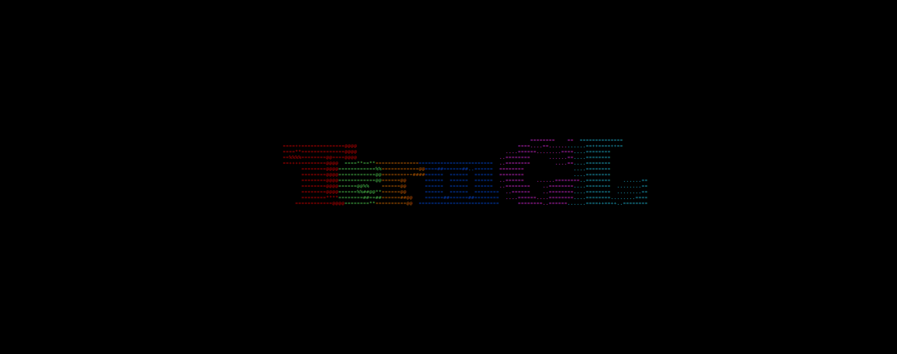

# TermGL

[](https://lgtm.com/projects/g/wojciech-graj/TermGL/context:cpp)

A terminal-based graphics library for both 2D and 3D graphics.\
Works in all terminals supporting ANSI escape codes.\
Support for Windows and UNIX.\
C99 compliant, with no external dependencies.\
Realtime input reading from terminal for user-interaction.\
16 Background colors, 16 foreground colors, bold and underline.

## Table of Contents

[Gallery](https://github.com/wojciech-graj/TermGL/blob/master/README.md#Gallery)\
[Build](https://github.com/wojciech-graj/TermGL/blob/master/README.md#Build)\
[Documentation](https://github.com/wojciech-graj/TermGL/blob/master/README.md#Documentation)

## Gallery




## Build

### C

To enable 3D functionality, use the ```-DTERMGL3D``` compiler flag\
To enable utility functions, use the ```-DTERMGLUTIL``` compiler flag\
When running makefile, additional cflags can be specified be passing a command line argument ```CFLAGS=-DTERMGL3D\ -DTERMGLUTIL```

#### Method 1: Regular source file

1. Add the following flags to your compiler ```-I/path/to/TermGL/lib -lm```
2. Add termgl.c as a source file to be compiled

#### Method 2: Shared library

1. Run the makefile ```make shared``` to create ```lib/libtermgl.so```
2. Copy to library directory ```sudo cp lib/libtermgl.so /usr/local/lib/libtermgl.so```
3. Add the following flags to your compiler ```-I/path/to/TermGL/lib -ltermgl -lm```

#### Method 3: Static library

1. Run the makefile ```make shared``` to create ```lib/libtermgl.so```
2. Add the following flags to your compiler ```-I/path/to/TermGL/lib -L/path/to/TermGL/lib -ltermgl -lm```

### C++

The above Methods 2 and 3 for C can be used to use TermGL in C++

### Windows

Compilation for Windows can be done by chaning the compiler using the following command line argument when running the makefile ```COMPILER=```.
If compiling using mingw on linux, use ```COMPILER=i686-w64-mingw32-gcc-win32```.

### Demo

To compile a demo program, run the makefile ```make demo```.

## Documentation

Certain settings can be changed at the top of [lib/termgl.h](lib/termgl.h) prior to compilation, e.g. memory allocation functions, clear screen command, compiler-specific commands.\
The header file [lib/termgl.h](lib/termgl.h) contains brief documentation for all functions and structs.\
Compiler-specific (GCC) macros are used for loop unrolling in the ```itgl_mulmat``` and ```itgl_clip_triangle_plane``` functions.\
The TermGLUtil extension contains functions for reading keyboard input, but requires either Windows of UNIX headers.

### Demo

A demo can be found here: [demodir/termgl_demo.c](demodir/termgl_demo.c).\
Available demos and TermGL features used:
1. Utah Teapot\
Renders a rotating 3D Utah Teapot.
	- Backface culling
	- Z buffering
	- Double-width characters
	- 3D camera
	- 3D transformations
	- 3D rendering
	- 3D Shaders
2. Star Polygon\
Renders a star polygon in steps using random colors.
	- Colors
	- Line rendering
3. Color Palette\
Renders a palette of various text colors and styles.
	- Colors & Modifiers
4. Mandelbrot\
Renders an infinitely zooming-in Mandelbrot set.
	- Point rendering
5. Realtime Keyboard\
Displays keyboard input in realtime.
	- Text rendering
	- Realtime keyboard input
