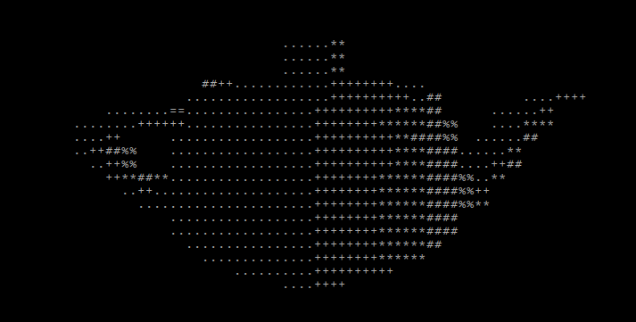

# TermGL

[](https://lgtm.com/projects/g/wojciech-graj/TermGL/context:cpp)

A terminal-based graphics library for both 2D and 3D graphics.\
Works in all terminals supporting ANSI escape codes.\
C11 compliant, only reliant on the C standard library.

A single-header version created by [assyrianic](https://github.com/assyrianic) can be found in [their repo](https://github.com/assyrianic/TermGL). It will not have ongoing support.

## Table of Contents

[Gallery](https://github.com/wojciech-graj/TermGL/blob/master/README.md#Gallery)\
[Build](https://github.com/wojciech-graj/TermGL/blob/master/README.md#Build)\
[Documentation](https://github.com/wojciech-graj/TermGL/blob/master/README.md#Documentation)

## Gallery




## Build

### C

To enable 3D functionality, use the ```-DTERMGL3D``` flag when compiling\
To enable utility functions, use the ```-DTERMGLUTIL``` flag when compiling\
When running makefile, additional cflags can be specified be passing a command line argument ```CFLAGS=-DTERMGL3D\ -DTERMGLUTIL```

#### Method 1: Regular source file

1. Add the following flags to your compiler ```-I/path/to/TermGL/lib -lm```
2. Add termgl.c as a source file to be compiled

#### Method 2: Shared library

1. Run the makefile ```make shared``` to create ```lib/libtermgl.so```
2. Copy to library directory ```sudo cp lib/libtermgl.so /usr/local/lib/libtermgl.so```
3. Add the following flags to your compiler ```-I/path/to/TermGL/lib -ltermgl -lm```

#### Method 3: Static library

1. Run the makefile ```make shared``` to create ```lib/libtermgl.so```
2. Add the following flags to your compiler ```-I/path/to/TermGL/lib -L/path/to/TermGL/lib -ltermgl -lm```

### C++

The above Methods 2 and 3 for C can be used to use TermGL in C++

### Demo

To compile a demo program, run the makefile ```make demo```

### Windows

To compile using mingw for Windows, include the following command line argument when running the makefile ```COMPILER=i686-w64-mingw32-gcc-win32```

## Documentation

Certain settings can be changed in [lib/termgl.h](lib/termgl.h), e.g. memory allocation functions, clear screen command, compiler-specific commands.\
A sample program exists here: [test/termgl_test.c](test/termgl_test.c), and utilizes all major features of the TermGL library.\
The header file [lib/termgl.h](lib/termgl.h) contains brief documentation for all functions and structs.\
Compiler-specific (GCC) macros are used for loop unrolling in the ```itgl_mulmat``` and ```itgl_clip_triangle_plane``` functions
